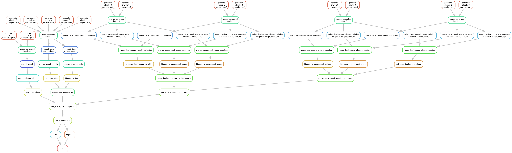

# REANA example - BSM search

[](https://github.com/reanahub/reana-demo-bsm-search/actions)
[](https://forum.reana.io)
[](https://raw.githubusercontent.com/reanahub/reana-demo-bsm-search/master/LICENSE)
[](https://reana.cern.ch/launch?url=https%3A%2F%2Fgithub.com%2Freanahub%2Freana-demo-bsm-search&name=reana-demo-bsm-search)

## About

This [REANA](http://reanahub.io/) reproducible analysis example emulates a
typical Beyond Standard Model (BSM) search as performed in collider particle
physics. It involves processing three main groups of data:

1. The observed collision data as it was recorded from the detector
1. The Standard Model Backgrounds relevant for the search
1. The Beyond Standard Model signal sample.

After processing, a statistical model involving both signal and control regions
is built and the model is fitted against the observed data. In this emulation,
the data is compatible with the Standard Model expectation, and thus an upper
limit on the signal strength of the BSM process is computed, which is the main
output of the workflow.

This example uses the [ROOT](https://root.cern.ch/) data analysis framework and
[Snakemake](https://snakemake.readthedocs.io/) computational workflow engine.

## Analysis structure

Making a research data analysis reproducible basically means to provide
"runnable recipes" addressing (1) where is the input data, (2) what software was
used to analyse the data, (3) which computing environments were used to run the
software and (4) which computational workflow steps were taken to run the
analysis. This will permit to instantiate the analysis on the computational
cloud and run the analysis to obtain (5) output results.

### 1. Input data

In this example, the input datasets representing the collision and simulated
data will be generated on the fly in the first couple of workflow steps.
Therefore there is no explicit input data to be taken care of.

### 2. Analysis code

This example uses the [ROOT](https://root.cern.ch/) analysis framework with the
custom user code located in the `code` directory. In order to execute the
different stages of the analysis a number of scripts are needed. In a real
analysis these scripts might be part of larger analysis frameworks developed
using the experiment-internal software stack (e.g. CMSSW or the ATLAS Analysis
Releases) and be based on C++ with many dependencies and require multiple
container images. In this emulation we have two container images.

1. The ROOT6 image `docker.io/reanahub/reana-env-root6` is used for merging ROOT
   files.
1. The image `docker.io/reanahub/reana-demo-bsm-search` extends ROOT6 with the
   `hftools` package. It is used for generation, selection, histogramming,
   fitting, plotting, and exporting to HEPData.

#### [generantuple.py](code/generantuple.py) - Generating Toy Data

This script generates toy datasets needed for the analysis. The script has the
command line interface

`python code/generantuple.py {type} {nevents} {outputfile} [seed] [configfile]`,

where `{type}` can be one of `[data, mc1, mc2, qcd, sig]` generating "observed
data", two background processes "mc1" or "mc2", a "multijet-background" and
finally the BSM signal process, respectively. The "data" is just a specific mix
of the other three processes according to their respective cross sections.

The dataset which is a collection of "events" (the number of events is
controlled by the `{nevents}` parameters) which is stored in a ROOT TNtuple at
the path indicated by `{outputfilename}`.

The optional seed makes the generated events reproducible. Omitting it, or
passing `-1`, uses Python's non-deterministic default seeding. The optional
configuration file supplies the toy distributions and observed-data mixture;
omitting it preserves the original `mc1` and `mc2` defaults.

Since dataset generation is easily parallelizable, ultimately we will run many
of these jobs at the same time and merge the TNtuples via ROOT's `hadd` utility.

#### [select.py](code/select.py) - Selecting Interesting Events

This is the main "event selection" code that processes the datasets and selects
"interesting events" and applies correction and systematic variations to the
events. In a real analysis this would be the bulk of the analysis code
implemented in a C++ experiment framework. In this example, the cli structure of
the script is

`python code/select.py {inputfile} {outputfile} {region} var1,var2,... [seed] [configfile]`

where an input and output files are specified as well as the region (i.e. either
signal or control region) and a number of comma-delimited systematic variations
are specified. The code then applies cuts and variations to the events and
writes the selected events into a new TNtuple which is saved to disk. In this
case only variations that affect the event selection need to be specified.
Variations that only affect the event weights are dealt with in the
histogramming step (see below).

The seed is optional here as well. It affects the random shifts applied by shape
variations. The optional configuration supplies the weight factors and shape
shift ranges; omitting it preserves the original systematic definitions.

#### [histogram.py](code/histogram.py) - Summarize Events in histograms

This script reads in the TNtuple of the selected events and creates the required
histograms for building the statistical model and weights them to a specific
luminosity. The command structure is

`python code/histogram.py {inputfile} {outputfile} {name} {weight} var,var2,...`

the variations in this case are weight-only variations.

#### [makews.py](code/makews.py) - Building a Statistical Model

This script creates a `RooWorkspace` using the HistFactory p.d.f template. The
HistFactory configuration has a single channel containing observed data, a
data-driven QCD estimate, the configured simulated backgrounds, and a signal.
The parameter of interest is the normalization of the signal sample (the signal
strength). For fitting and plotting the resulting workspace we use an external
package called `hftools` (HistFactory tools), which provides command line tools
for these purposes. The command line structure is

`python code/makews.py {data_bkg_hists} {workspace_prefix} {xml_dir} [configfile]`

The script expects all data and background histograms to be collected in a
single ROOT file and writes the XML configuration and workspace to the paths
specified on the command line. When a configuration file is supplied, the
background samples and their systematic variations are read from it. Omitting
the configuration preserves the original `mc1` and `mc2` defaults.

#### [hepdata_export.py](code/hepdata_export.py) - Preparing a HepData submission

The final step of an analysis is often to prepare a HepData submission in order
to archive measured distributions and results on the HepData archive. Here we
use `hftools` as a python library in this script, which has some convenience
functions to generated HepData tables from a `RooWorkspace`.

The command line structure is:

`python code/hepdata_export.py {combined_model} [submission] [data] [configfile]`

The optional configuration makes the exported sample list follow the configured
backgrounds. Omitting it preserves the original `mc1` and `mc2` defaults.

### 3. Compute environment

In order to be able to rerun the analysis even several years in the future, we
need to "encapsulate the current compute environment", for example to freeze the
ROOT version our analysis is using. We shall achieve this by preparing a
[Docker](https://www.docker.com/) container image for our analysis steps.

Some of the analysis steps will run in a pure [ROOT](https://root.cern.ch/)
analysis environment. We can use an already existing container image, for
example [reana-env-root6](https://github.com/reanahub/reana-env-root6), for
these steps.

Some of the other analysis tasks wil need `hftools` Python library installed
that our Python code needs. We can extend the `reana-env-root6` image to install
`hftools` and to include our own Python code. This can be achieved as follows:

```console
$ less environments/reana-demo-bsm-search/Dockerfile
```

```Dockerfile
# Start from the ROOT6 base image:
FROM docker.io/reanahub/reana-env-root6:6.18.04

# Install HFtools and its dependencies:
RUN apt-get -y update && \
    apt-get -y install \
       libyaml-dev \
       python-numpy \
       zip && \
    apt-get autoremove -y && \
    apt-get clean -y
RUN pip install hftools==0.0.6

# Mount our code:
ADD code /code
WORKDIR /code
```

We can build our analysis environment image and give it a name
`docker.io/reanahub/reana-demo-bsm-search`:

```console
$ docker build -f environment/Dockerfile -t docker.io/reanahub/reana-demo-bsm-search .
```

We can push the image to the DockerHub image registry:

```console
$ docker push docker.io/reanahub/reana-demo-bsm-search
```

(Note that typically you would use your own username such as `johndoe` in place
of `reanahub`.)

### 4. Analysis workflow

This analysis example intends to emulate fully what is happening in a typical
BSM search analysis. This means a lot of computational steps with parallel
execution and merging of results.

We shall use the [Snakemake](https://snakemake.readthedocs.io/) workflow engine
to express the computational steps in a declarative manner. The
[Snakefile](workflow/Snakefile) workflow defines the full pipeline covering
data, signal, simulation, merging, fitting, plotting, and HEPData export steps:



At a very high level the workflow is as follows

1. Generate and process "observed data" to produce observed data and a
   data-driven multijet estimate in the signal region.

1. For each non-multijet Standard Model process (MC1 and MC2), generate and
   process datasets including systematic variations

1. Generate and Process a signal dataset

The three sub-workflows above can happen in parallel as they are independent of
each other. Once they are done the remaining steps needed are

1. Merge Outputs from subworkflows and prepare a Statisical Model.

1. Perform Fits and produce Plots.

1. Prepare a HepData Submission

```console
+---------------+   +--------------+    +------+
| Data & Mulijet|   |SM Backgrounds|    |Signal|
+---------------+   +--------------+    +------+
     |                 |                 |
     |                 |                 |
     +-------->        v      <----------+
                    +--+--+
                    |Merge|
                    +--+--+
                       |
                       v
                 +----------+
                 | Workspace|
                 +----------+
+-----------+      |      |          +------------------+
|Fit & Plots|  <---+      +---->     |HepData Submission|
+-----------+                        +------------------+
```

#### How the Snakefile expresses the workflow

Snakemake works backwards from requested output files. The first rule,
`rule all`, names the plots and HEPData archive that constitute a complete run.
For each requested file, Snakemake finds a rule that can create it and continues
following that rule's inputs until it has constructed the complete directed
acyclic graph (DAG). Dependencies therefore follow from filenames instead of
being listed as explicit stage-to-stage links.

The workflow uses several common Snakemake features:

- **Wildcards** such as `{sample}`, `{chunk}`, and `{shapevar}` generalise one
  rule over many jobs. Wildcard constraints limit them to values supported by
  the configuration.
- **`expand()` and input functions** enumerate fan-in dependencies. For example,
  a merge job obtains the generated chunks belonging to one batch from an input
  function.
- **Named inputs and outputs** make shell commands self-documenting. Analysis
  scripts are named inputs too, so changing a script causes Snakemake to rerun
  the affected jobs. The scripts keep their normal command-line interfaces and
  can still be run manually.
- **`container:` directives** associate every rule with its software image.
  REANA uses these declarations to run each job in the requested environment.
- **`log:` directives** retain per-job logs under `logs/` while `tee` also sends
  the output to REANA's job logs.
- **`temp()` outputs** identify disposable intermediate files under `work/`.
  Snakemake removes a temporary file only after its final consumer succeeds.
  This is safer and more storage-efficient than a manually ordered cleanup
  stage.

#### The Data Workflow

The subworkflow generating and processing the "observed data" goes through these
high-level stages.

1. **Generate the data.** Independent jobs generate data chunks. Merge jobs
   combine at most six chunks at a time so that later processing does not depend
   on an excessive number of files.
1. **Process the signal region.** This branch selects and histograms the events
   against which the statistical model is fitted.
1. **Estimate multijet background from the control region.** This branch selects
   and histograms control-region events, then applies a transfer factor to
   estimate the multijet, or QCD, background in the signal region.
1. **Merge the histograms.** The observed data and data-driven background are
   collected in one ROOT file.

#### The SM Background Workflow

For each of the SM backgrounds that are not estimated directly from the data, we
use generated Monte-Carlo samples. For the Standard Model backgrounds we
generate and process these datasets including systematics variations. These
systematic variations change the values of the variables that are used to select
"interesting events" as well as the "weight" of the event that is used when
filling the histograms.

The SM Background sub-workflow splits into further sub-sub-workflows performed
for each of the background processes. In this emulation we have two such
processes.

For each sample, we go through the following stages

1. Generate datasets for the background processes
1. Run Event selection for Signal region
1. Histogram Events (with correct luminosity weighting)

As some systematics affect the variables that are cut on in the event selection
(so-called shape variations), the event selection step needs to be performed
multiple times, once for each variation. Therefore, there is an additional
branch for processing shape variations.

Systematics only affecting the weights can be implemented in one go at the
histogramming stage.

As we progress through these stages, we add merging steps to reduce the number
of files that need to be handled.

Finally, all histograms for a single Monte Carlo samples are collected before
merging all Monte-Carlo samples into a single ROOT file.

#### The Signal Workflow

The Signal workflow is very similar to the SM Background workflow, but we do not
consider any systematics. Therefore it is a simple workflow that selects and
histograms events (with a couple of merge stages in between).

#### Putting everything together

The [configuration file](workflow/config.yaml) defines event chunks, sample
weights, containers, systematic variations, and the base random seed. It is
validated against [config.schema.yaml](workflow/config.schema.yaml) while the
Snakefile is parsed, so misspelled keys and incomplete systematic pairs fail
before any jobs are submitted.

The REANA 0.95 prerelease currently has a dependency conflict affecting this
Snakemake 9 validation API. See the
[REANA Snakemake validation note](docs/reana-snakemake-validation.md) for the
reproduction and proposed upstream action.

```yaml
containers:
  analysis: docker://docker.io/reanahub/reana-demo-bsm-search:1.0.0
  root: docker://docker.io/reanahub/reana-env-root6:6.18.04

workdir: work
random_seed: 12345

data:
  nevents: [20000, 20000, 20000, 20000, 20000]
  qcd_transfer_factor: 0.1875
  control_region_fraction: 0.8
  qcd_fraction: 0.75
  qcd_generator: { loc: 5, scale: 4 }

signal:
  nevents: [40000, 40000]
  weight: 0.0025
  generator: { loc: 1, scale: 0.5 }

backgrounds:
  mc1:
    nevents: [40000, 40000, 40000, 40000]
    weight: 0.01875
    data_fraction: 0.15
    generator: { loc: -3, scale: 1.5 }

systematics:
  weight:
    weight_var1:
      up: { name: weight_var1_up, factor: 1.05 }
      down: { name: weight_var1_dn, factor: 0.95 }
  shape:
    shape_conv:
      up: { name: shape_conv_up, shift: [0, 1] }
      down: { name: shape_conv_dn, shift: [-1, 0] }
```

Background names are not hard-coded in the workflow, generator, or
workspace-building script. Adding another entry below `backgrounds` creates its
generation, selection, histogram, model, and plotting jobs. Its `generator`
defines the toy normal distribution and `data_fraction` defines its contribution
to observed data in the signal region. The background fractions together with
`data.qcd_fraction` must sum to one. Each systematic is expressed as an explicit
up/down pair. Weight variations define a multiplicative `factor`; shape
variations define a uniformly sampled `shift` interval. These definitions are
used both to create the variation histograms and to configure the HistFactory
model.

`random_seed` is a base seed rather than the seed passed to every job. The
Snakefile derives a stable, distinct seed from the base seed and the job's
sample, chunk, and variation. This makes results independent of scheduling
order. Set it to `-1` to disable deterministic seeding.

#### Checking and visualising the workflow locally

The included [Pixi](https://pixi.sh/) environment provides Snakemake and
Graphviz. A dry run constructs and prints the DAG without executing ROOT jobs:

```console
$ pixi install
$ pixi run snakemake-dry-run
```

Run the Snakemake linter and regenerate the DAG image with:

```console
$ pixi run snakemake-lint
$ pixi run workflow-dag
```

#### Running locally with containers

The Pixi tasks above inspect the workflow but do not run its containerised ROOT
jobs. On a Linux machine with Apptainer installed, the complete workflow can be
run with:

```console
$ pixi run snakemake -s workflow/Snakefile --cores 4 \
    --software-deployment-method apptainer
```

Without `--software-deployment-method apptainer`, local Snakemake ignores the
`container:` directives and expects ROOT and `hftools` to be installed in the
local environment. On REANA, the workflow engine interprets the container
declarations directly, so no local Apptainer installation is needed.

Please see the [Snakefile](workflow/Snakefile) and the
[Snakemake documentation](https://snakemake.readthedocs.io/) for further
details.

### 5. Output results

The interesting fragements generated by this result are the pre- and the
post-fit distributions of the individual samples as well as the HepData
submission in the form of a ZIP archive.

Below we see the model at its pre-fit configuration at nominal signal strength
mu=1. The signal distribution is shown in green. As we can see the nominal
setting does not describe the data, which is shown in black dots, well.


Here we see the post-fit distribution. As we can see, the signal sample needed
to be scale down significantly to fit the data, which is expected since we
generated the data in accordance with a SM-only scenario.


## Running the example on REANA cloud

There are two ways to execute this analysis example on REANA.

If you would like to simply launch this analysis example on the REANA instance
at CERN and inspect its results using the web interface, please click on the
following badge:

[](https://reana.cern.ch/launch?url=https%3A%2F%2Fgithub.com%2Freanahub%2Freana-demo-bsm-search&name=reana-demo-bsm-search)

If you would like a step-by-step guide on how to use the REANA command-line
client to launch this analysis example, please read on.

We start by creating a [reana.yaml](reana.yaml) file describing the above
analysis structure with its inputs, code, runtime environment, computational
workflow steps and expected outputs:

```yaml
version: 0.6.0
inputs:
  directories:
    - code
    - workflow
workflow:
  type: snakemake
  file: workflow/Snakefile
outputs:
  files:
    - hepdata/submission.zip
    - plot/prefit.pdf
    - plot/postfit.pdf
```

We can now install the REANA command-line client, run the analysis and download
the resulting plots:

```console
$ # create new virtual environment
$ virtualenv ~/.virtualenvs/myreana
$ source ~/.virtualenvs/myreana/bin/activate
$ # install REANA client
$ pip install reana-client
$ # connect to some REANA cloud instance
$ export REANA_SERVER_URL=https://reana.cern.ch/
$ export REANA_ACCESS_TOKEN=XXXXXXX
$ # create new workflow
$ reana-client create -n my-analysis
$ export REANA_WORKON=my-analysis
$ # upload input code and data to the workspace
$ reana-client upload
$ # start computational workflow
$ reana-client start
$ # ... should be finished in about 15 minutes
$ # check its status
$ reana-client status
$ # list workspace files
$ reana-client ls
$ # download generated plots
$ reana-client download
```

Please see the [REANA-Client](https://reana-client.readthedocs.io/)
documentation for more detailed explanation of typical `reana-client` usage
scenarios.
